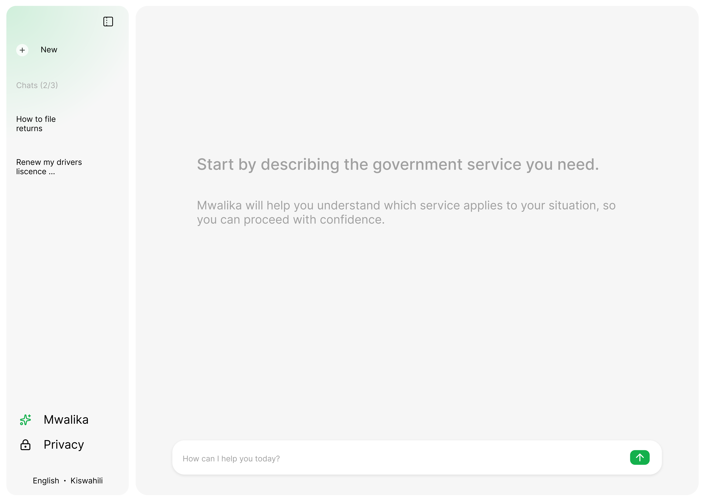

# Mwalika Frontend

This repository contains the frontend for **Mwalika**, including
the landing page, privacy page, and chat interface that allows
users to interact with the Mwalika agent.

Mwalika helps citizens discover the right eCitizen service
through simple conversation. Instead of navigating complex
menus, users can describe what they need and be guided toward
the appropriate government service.

Mwalika is an experimental civic technology project built
during a national hackathon in Kenya. The goal is to explore
how conversational AI can make public services easier to
understand and access.

## Backend

The frontend communicates with the Mwalika backend, which
powers the AI agent and handles the conversational logic.

Backend repository:

[mwalika-agent](https://github.com/karaalv/mwalika-agent)

## Disclaimer

Mwalika is an independent project and is **not affiliated with
the Government of Kenya or the eCitizen platform**.

Information provided through the system is intended for
guidance only. Users should verify service details through
official government sources before submitting any applications.

## License

This project is licensed under the Apache License 2.0.
See the `LICENSE` file for details.
